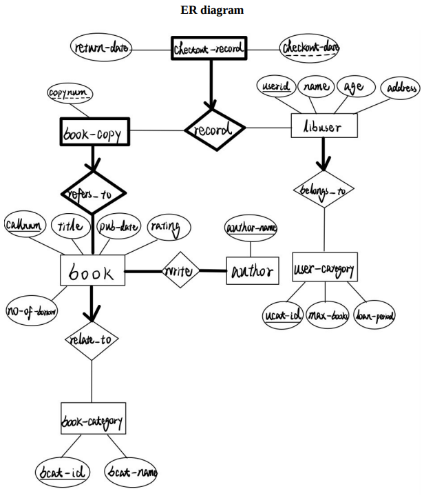
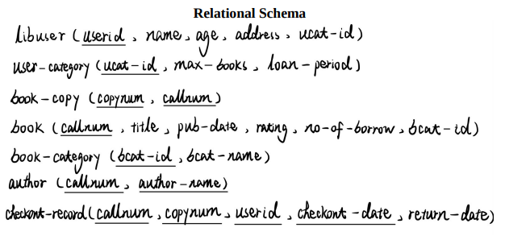

# Library Inquiry System

## Project Manual Reference

- [The Chinese University of Hong Kong, Computer Science Department](https://www.cse.cuhk.edu.hk/)

## Three Roles

- Administrator
- Library User
- Librarian

## Duties

### Administrator:

1. **Create table schemas in the database:** This function creates all the tables for this system based on the relational schema given.
2. **Delete table schemas in the database:** This function deletes all existing tables in the system.
3. **Load data from a dataset:** After a user enters the path of the folder that contains the data files, the system reads all data files from the user-specified folder and inserts the records into the appropriate table in the database. (Your program can assume that the user specified folder must contain all 5 data files. These 5 input files are named user_category.txt, user.txt, book_category.txt, book.txt and check_out.txt. Each data file stores the data corresponding to its filename.)
4. **Show the number of records in each table:** For each table in the database, display the number of
   records in it.

### Library User:

1. **Search for books:** The system is required to provide an interface to allow a library user to search for the books in the library in three different ways:
   - By call number (exact matching)
   - By title (partial matching)
   - By author (partial matching)
2. **Show all check-out records of a library user:** The system is required to provide an interface to allow a library user to show all his/her check out records of with a given user ID. After the library user enters his/her user ID, the program will perform the query and return all the matching check-out records in terms of call number, copy number, title, authors, check out date and whether the book copy of the corresponding check-out record is returned. The check-out records should be sorted in descending order of check-out date.

### Librarian:

1. **Borrow a book copy:** A librarian can perform the book borrowing procedure through the Library Inquiry System. First, he/she needs to input call number and copy number of the book copy being borrowed and the user ID of the library user. Then the system should check whether that book copy is available to be borrowed (i.e., There is no check out record of the specified book copy with NULL return date). If the book copy is available, it is then borrowed and a new check-out record of the specified book copy and user with NULL return date should be added to the database accordingly. Finally, there should be an informative message whether the book copy can be lent successfully in layman terms.
2. **Return a book copy:** A librarian can perform the book returning procedure through the Library Inquiry System. First, he/she needs to input call number and copy number of the book copy being borrowed and the user ID of the library user. Then the system should check if a check-out record corresponding to the specified user ID, call number and copy number exists. If such record is found, the book copy can be returned, and the return date of the check-out record found is updated to be the current date of the database server. Besides, the rating of the book should be updated by the following formula, and the number of times borrowed should be increased by one.
3. **List all un-returned book copies which are checked-out within a period:** The system is required to provide an interface to allow a librarian to list all un-returned book copies which are checked-out within a given period (e.g., from 20/03/2021 to 20/04/2021). After the librarian enters the period, the program will perform the query and return a list of all un-returned book copies in terms of user ID, call number, copy number and check-out date in descending order of check-out date within the inputted period inclusively.

## Error Handling

If a run-time error occurs, the Library Inquiry System should output an information message in layman terms and in a new line.

## ER-Diagram & Relational Schema Design

ER-Diagram:


Relational Schema:


## Start

```
Change MySQL setting (If needed):
    - In Line 9, 10 , 11
        final String dbAddress = "jdbc:mysql://projgw.cse.cuhk.edu.hk:2633/db2";
        final String dbUsername = "Group2";
        final String dbPassword = "Group2winwinwin";

How to compile and run:

Method1: On Linux
Step1->Compilation:
javac Main.java

Step2->Execution:
java -cp .:mysql-connector-java-5.1.47.jar Main


Method2: On Windows CMD
Step1->Compilation:
javac Main.java

Step2->Execution:
java -cp .;\path\to\mysql-connector-java-5.1.47.jar Main

NOTE: The mysql-connector-java-5.1.47.jar should be placed in the same directory.
NOTE: Java version 6 / 8
```

## Statement:

The source code of this project is owned by me (Glenn Cai), and everyone is welcome to use it as a learning reference. I am not responsible for any plagiarism found for submitting any coursework using this code.
